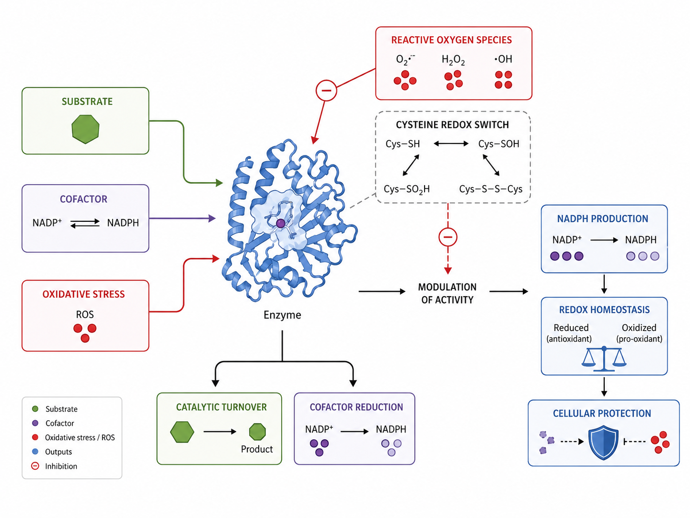
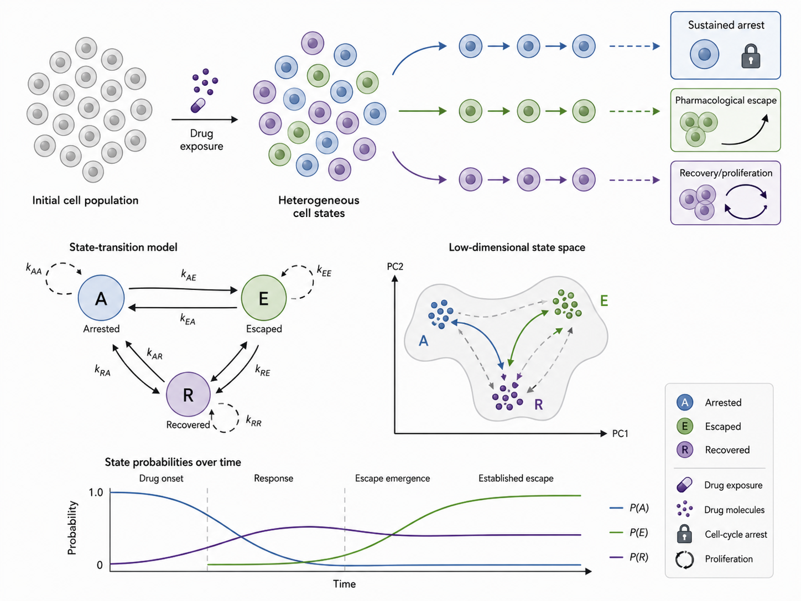
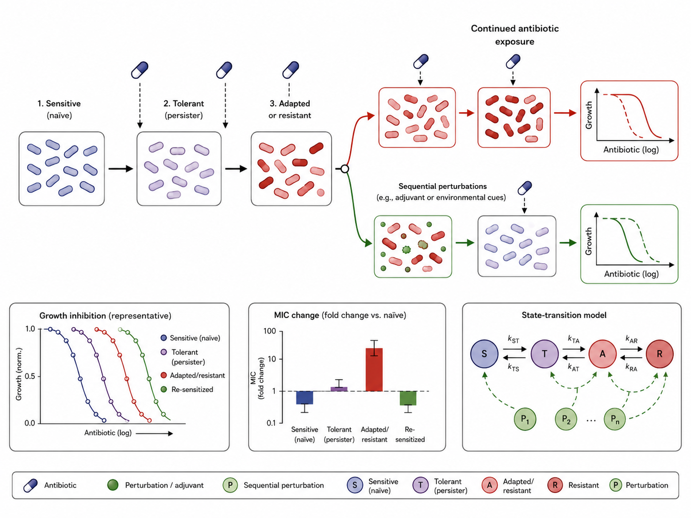
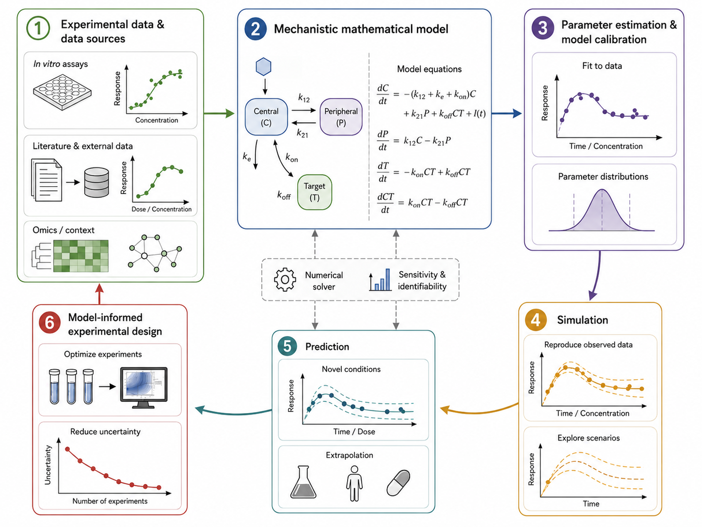

Our research investigates how biological systems dynamically respond to perturbations, using mechanistic models integrated with experimental data to predict adaptation, escape, and recovery.

We combine **quantitative pharmacology**, **systems modeling**, **experimental data**, and **mathematical modeling** to connect biological mechanisms with dynamic behavior across molecular, cellular, and population scales.

## Research themes

::: {.research-row}

::: {.research-image}
{fig-alt="Enzyme regulation and redox biology" width="100%"}
:::

::: {.research-text}

### Enzyme regulation and redox biology

We study how enzyme activity is regulated by substrate availability, cofactor interactions, and oxidative stress. A current focus is **human glucose-6-phosphate dehydrogenase** and its role in redox metabolism.

This line integrates enzyme kinetics, structural information, redox biology, and mechanistic modeling to understand how oxidative perturbations can modulate enzymatic activity and downstream metabolic responses.

:::

:::

::: {.research-row}

::: {.research-image}
{fig-alt="Cell-state heterogeneity and pharmacological escape" width="100%"}
:::

::: {.research-text}

### Cell-state heterogeneity and pharmacological escape

We develop population models to understand why genetically similar cells can respond differently to the same pharmacological perturbation, including arrest, escape, and recovery dynamics.

This line focuses on dynamic cell-state transitions, heterogeneous drug responses, and the identification of subpopulations that may evade expected pharmacological effects.

:::

:::

::: {.research-row}

::: {.research-image}
{fig-alt="Antimicrobial adaptation and reversibility" width="100%"}
:::

::: {.research-text}

### Antimicrobial adaptation and reversibility

We aim to understand how bacterial populations adapt to antibiotic exposure and whether resistant phenotypes can be modulated or reversed through sequential perturbations.

This line combines in vitro data, growth-response measurements, MIC-based readouts, and mechanistic models to study adaptation, resistance, re-sensitization, and recovery dynamics.

:::

:::

::: {.research-row}

::: {.research-image}
{fig-alt="Modeling approach workflow" width="100%"}
:::

::: {.research-text}

### Modeling approach

Our work combines **in vitro experimental data**, **literature-derived data**, quantitative readouts, and mechanistic mathematical models.

We use ordinary differential equations, parameter estimation, model calibration, simulation, prediction, sensitivity analysis, and model-informed experimental design to generate testable hypotheses and guide future experiments.

:::

:::